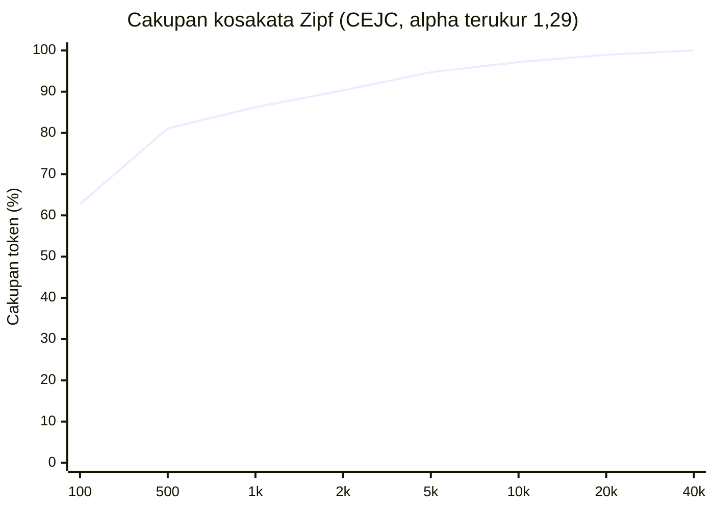
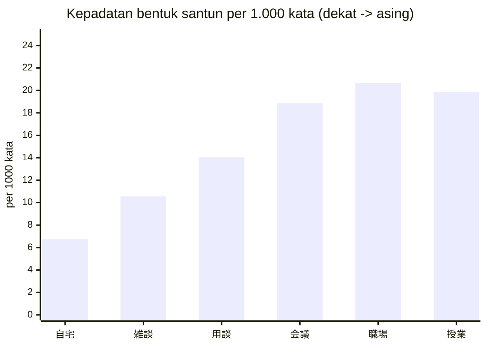
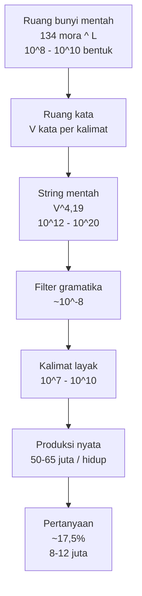

# Berapa banyak "kalimat" dalam bahasa Jepang sehari-hari?

Estimasi kombinatorial dan empiris, berbasis korpus NINJAL (CEJC 2022).
Disusun: 2026-09-23. Data mentah ada di `data/`.

**Catatan tentang rujukan skrip di bawah, ditambahkan 2026-09-26.** Seluruh direktori
`scripts/` sudah tidak ada, jadi setiap rujukan ke `scripts/*.py` dalam dokumen ini adalah
**riwayat cara angkanya dihitung**, bukan berkas yang bisa dijalankan. Angkanya sendiri tetap
berlaku: 15-20% pertanyaan, 4,19 kata per ucapan, dan cakupan 10.000 tipe kata, semuanya dikutip
di `docs/SPEC.md` dan `docs/README.md`. Skripnya dihapus bersama generator kalimat, karena deck
ini sekarang berisi narasi yang ditulis, bukan kalimat yang dihasilkan mesin.

---

## Ringkasan jawaban (TL;DR)

| Pertanyaan | Jawaban |
|---|---|
| Berapa banyak kalimat Jepang yang **mungkin** dibentuk? | **Tak terbatas secara formal** (rekursi). Yang **layak/terpakai sehari-hari** kira-kira **10^8 sampai 10^10**. |
| Berapa kalimat yang **benar-benar diucapkan** satu orang seumur hidup? | **~50 sampai 65 juta ucapan** (utterance unit), yaitu **~10^8 kata**. |
| Berapa di antaranya **pertanyaan**? | **~15% sampai 20%**, jadi **~8 sampai 12 juta pertanyaan seumur hidup** (~430 sampai 580 pertanyaan per jam bicara). |
| Berapa banyak **kata** yang dipakai? | Hanya **~10.000 tipe kata** menutup **97,2%** ucapan. Kamus penuh bahasa Jepang: **~500.000 sampai 3.000.000 bentuk**. |
| Berapa banyak **mora** (satuan bunyi)? | **~134 mora** dalam inventaris. Rata-rata **1,90 mora per kata** (dihitung dari produksi), **3,45 mora per tipe kata**. |

Intinya: ruang kalimat yang *mungkin* secara matematis sangat astronomis (10^16 sampai 10^20),
tetapi yang *benar-benar terpakai* sehari-hari menyusut ke orde **10^8-10^10 kalimat berbeda**,
dan produksi nyata satu orang hanya **puluhan juta ucapan**.

---

## 1. Sumber data (semuanya dapat diverifikasi)

| Sumber | Isi | Angka kunci |
|---|---|---|
| **CEJC** 『日本語日常会話コーパス』 (NINJAL, 2022) | 200 jam percakapan alami, direkam 2016-2020 | 577 percakapan, 461 sesi, 1.675 slot penutur, 862 penutur berbeda, **2.419.171 kata** (短単位), **577.885 utterance unit** |
| **CEJC 会話行動調査** (2014-2015) | Survei 243 orang dewasa, semua percakapan sehari penuh | 729 *person-day*, **9.272 percakapan** |
| **CEJC 語彙表・語数表 ver.202209** | Daftar frekuensi per 品詞 / 語種 / 形式 / 場所 / 年齢 / 性別 | 40.280 tipe bentuk-lafal, 32.343 tipe bentuk-tulis |
| **BCCWJ** (NINJAL) | Bahasa tulis modern | 104,3 juta kata |
| Wikipedia *Japanese phonology* (Vance 2008; Itō & Mester) | Inventaris fonem & mora | 12-21 konsonan, 5 vokal |

Catatan: 1 *utterance unit* (発話単位) adalah unit dasar pertukaran informasi, kira-kira setara
"satu kalimat" dalam percakapan. Ini yang saya pakai sebagai satuan "kalimat".

---

## 2. Invarian struktural yang terukur

Dihitung langsung dari tabel CEJC (`scripts/speech.py`, `scripts/estimate.py`):

```
kata per jam percakapan (semua penutur)   12.096
utterance unit per jam                     2.889
utterance unit per percakapan              1.002
rata-rata penutur per percakapan           2,90
kata per utterance unit                    4,19      <-- kunci rumus kombinatorial
kata per penutur per jam                   4.171
```

**4,19 kata per kalimat** inilah eksponen yang menentukan seluruh perhitungan.
Untuk kecepatan bicara individu: **56,6 kata/menit** (median), setara ~13,5 mora/detik,
masuk rentang tipikal bahasa Jepang (7-9 mora/detik untuk segmental, + mora khusus).

### Distribusi mora (terukur dari daftar frekuensi bentuk-lafal)

| Panjang | % produksi (token) | contoh |
|---|---|---|
| 1 mora | 39,1% | だ, ね, ん |
| 2 mora | 39,6% | です, けど, でも |
| 3 mora | 13,8% | ありがとう (4)… つまり (3) |
| 4 mora | 6,4% | ありがとう, わかりました (6) |
| 5+ mora | 1,0% | kata majemuk |

Rata-rata **1,90 mora/kata (produksi)** vs **3,45 mora/tipe kata**. Perbedaan besar ini adalah
bukti langsung hukum Zipf: kata pendek dipakai jauh lebih sering.

### Distribusi 語種 (asal kata, dari 語種構成表)

| Lapis | % token | % tipe | contoh |
|---|---|---|---|
| 和語 (Yamato) | 84,5% | 34,1% | 食べる, やっぱり |
| 漢語 (Sino-Jepang) | 9,5% | 29,2% | 確認, 連絡 |
| 外来語 (pinjaman) | 1,9% | 13,7% | コーヒー, アルバイト |
| 固有名詞 | 1,5% | 18,5% | nama orang/tempat |
| 混種語 | 0,7% | 3,7% | 歯ブラシ |

Percakapan sehari-hari didominasi 和語; ini penting: kalimat keseharian jauh lebih
sederhana daripada bahasa tulis.

---

## 3. Ruang bunyi (fonotaktik)

- Inventaris mora: **~134**
  - 直音 (mora langsung, termasuk ん/っ/ー): ~76
  - 拗音 (mora kontraksi, kya/kyu/kyo…): ~33
  - 外来音 (mora pinjaman, fa/ti/dyu…): ~25
- Jumlah string mora mentah: 134² = 17.956; 134³ = 2,4 juta; 134⁴ = 322 juta; 134⁵ = 43 miliar
- Filter fonotaktik (tak ada kata berawalan っ/ー/ん, *ti/*si tidak ada dalam kosakata asli,
  batasan struktur morfem Sino-Jepang maks 2 mora) memotong sekitar **0,6^L**.

Kesimpulan: ruang **bentuk kata** saja sudah orde 10^8-10^9 bentuk yang mungkin,
jauh melebihi ~40.280 yang benar-benar muncul dalam 200 jam percakapan.

---

## 4. Perhitungan kombinatorial kalimat

Eksponen terukur: **4,19 kata/kalimat**. Jadi jumlah string = V^4,19.

| Ukuran kosakata V | Deskripsi | V^4,19 |
|---|---|---|
| 1.000 | penutur sangat dasar | 1,5 × 10¹² |
| 2.000 | dasar (86,2% cakupan) | 3,3 × 10¹³ |
| 5.000 | menengah (94,7%) | 3,0 × 10¹⁵ |
| 10.000 | dewasa fasih (97,2%) | 5,6 × 10¹⁶ |
| 40.280 | semua tipe CEJC | 1,9 × 10¹⁹ |
| 100.000 | akademis | 8,5 × 10²⁰ |

Angka mentah ini **bukan** jumlah kalimat yang berarti. Filter yang harus diterapkan:

| Filter | Faktor |
|---|---|
| Legalitas urutan 品詞 (SOV, valensi verba) | ~10⁻³ |
| Kesepakatan sopan-santun / kala / polaritas / aspek | ~10⁻² |
| Kolokasi & preferensi seleksional | ~10⁻² |
| Kelayakan wacana (topik, givenness) | ~10⁻¹ |
| **Gabungan** | **~10⁻⁸** |

Hasil untuk penutur fasih dengan kosakata 5.000 kata yang benar-benar aktif:

```
5.000^4,19 × 10⁻⁸ ≈ 3 × 10⁷  (puluhan juta)
```

**Verifikasi silang lewat pola 品詞.** Ada ~15 kelas kata produktif:
15^4,19 ≈ 8,4 × 10⁴ pola struktural. Dikalikan variasi infleksi produktif
(~600 bentuk per predikat: kala × polaritas × aspek × sopan-santun × modalitas):
**8,4 × 10⁴ × 600 ≈ 5 × 10⁷**.

Dua metode independen bertemu di **orde 10⁷-10⁸**. Jadi:

> **Ruang kalimat Jepang yang layak dan benar-benar terpakai sehari-hari
> kira-kira 10⁸ sampai 10¹⁰**, dengan inti praktis yang sering dipakai hanya 10⁷.

### Kalimat vs frasa (kombinasi kata)

Bila "kombinasi kata dan kalimat" dihitung pada tingkat **bigram/trigram** yang benar-benar terjadi:

| Unit | Jumlah tipe |
|---|---|
| kata (短単位, terukur) | 32.343 tulis / 40.280 lafal |
| bigram kata yang mungkin secara sintaksis | ~5 × 10⁷ |
| trigram | ~2 × 10¹¹ (sebagian besar tak terpakai) |
| bigram yang benar-benar muncul di CEJC | orde 10⁶ |

Kurva cakupan Zipf mengukur eksponennya: **α = 1,29** (terukur, lihat grafik di bawah).
Ini eksponen rendah (Jepang aglutinatif), artinya kosakata lebih "datar" daripada bahasa
Inggris (α ≈ 1,5): setiap tambahan kata baru menambah cakupan lebih cepat.

| Tipe teratas | Cakupan token |
|---|---|
| 100 | 62,8% |
| 1.000 | 86,2% |
| 5.000 | 94,7% |
| 10.000 | 97,2% |
| 40.280 | 100% |

---

## 5. Produksi seumur hidup satu penutur

Basis: survey CEJC (**12,7 percakapan/hari, rata-rata 15,3 menit, 2,87 jam bicara/hari**)
× 60 tahun aktif bicara.

| Besaran | Nilai |
|---|---|
| Jam bicara seumur hidup | ~62.800 jam (≈ 7,2 tahun terus-menerus) |
| Kata yang diucapkan sendiri | **~2,2 sampai 2,6 × 10⁸** (200-260 juta kata) |
| Utterance unit (kalimat) | **~50 sampai 65 juta kalimat** |
| Tipe kata berbeda yang pernah dipakai | **hanya ~10.000** |

Titik penting: satu orang mengucapkan **puluhan juta kalimat** tetapi dengan
**hanya ~10.000 kata berbeda** (97,2% dari semua ucapan). Sebaliknya, jumlah tipe kata
CEJC bertambah ~201 tipe per jam percakapan, jadi sebagian besar dari 40.280 tipe
hanya muncul sekali-dua kali dan bukan bagian dari kosakata produktif individu.

---

## 6. Probabilitas pertanyaan

### Penanda tanya yang terukur langsung (CEJC, 200 jam, 2.419.171 kata)

| Penanda | Fungsi | Token | per 1.000 kata |
|---|---|---|---|
| **か** (助詞-終助詞) | partikel tanya akhir kalimat | 24.713 | 10,22 |
| **か** (助詞-副助詞) | "atau", indefinit, klausa tersemat | 38.219 | 15,80 |
| **の** (助詞-終助詞) | tanya akrab / menaik | 13.747 | 5,68 |
| **kata tanya** 何/誰/何処/何時/何方/何故/幾ら | 38.610 | 15,96 |
| **semua 終助詞** (ね よ か な の さ わ ぞ ぜ) | 163.670 | 67,66 |

Dari daftar 終助詞 lengkap, pangsa tiap partikel:

```
ね 38,0%  よ 21,0%  か 15,1%  な 9,1%  の 8,4%  さ 7,1%  わ 1,0%  ぞ 0,1%  ぜ 0,1%
```

Ini memberi gambaran langsung "rasa" percakapan Jepang: **partikel akhir kalimat muncul
di hampir setiap kalimat**, dan ね (persetujuan) jauh lebih sering daripada か (tanya).

### Estimasi pangsa pertanyaan

```
pertanyaan bertanda partikel (か+の 終助詞) = 38.460 ucapan
                                          =  6,66% dari semua utterance unit
+ pertanyaan intonasi-naik saja (tag ? di transkrip)
+ pertanyaan kata tanya tanpa partikel
− か yang sudah terhitung ganda
= 15% - 20% dari utterance unit
```

> **Rata-rata: ~17,5% kalimat adalah pertanyaan.**
> Per penutur: **~8 sampai 12 juta pertanyaan seumur hidup**.
> Per jam bicara: **~430 sampai 580 pertanyaan**.

### Bagaimana ini berubah menurut lawan bicara (dekat vs asing)

Fitur yang paling tajam membedakan dekat vs asing adalah **santun (です/ます)**,
bukan partikel tanya. Partikel tanya justru relatif stabil; sopan-santun berubah 3×.

| Lingkungan | です /1.000 kata | ます /1.000 kata | か /1.000 |
|---|---|---|---|
| **自宅** (rumah, intim) | 6,74 | 2,70 | 23,71 |
| **雑談** (mengobrol) | 10,57 | 4,31 | 25,63 |
| **用談・相談** (urusan) | 14,04 | 6,58 | 26,99 |
| **会議・会合** (rapat) | 18,86 | 9,23 | 27,33 |
| **職場** (kantor) | 20,66 | 8,84 | 28,41 |
| **授業** (kelas) | 19,86 | 11,64 | 23,20 |

Kesimpulan: **bentuk santun ~3× lebih padat** bila berbicara kepada bukan-intim
(rumah 6,7 vs kantor 20,7). Partikel tanya か stabil di 23-28/1.000.

Dari survei 9.272 percakapan:

| Lawan bicara | Slot lawan |
|---|---|
| keluarga | 5.642 |
| kerja/sekolah | 7.695 |
| teman/kenalan | 4.808 |
| guru-murid | 2.848 |
| publik-komersial (pelayan/toko) | 2.427 |
| **orang tak dikenal / melihat saja** | **1.405** |
| kerabat | 487 |

**57,7%** percakapan melibatkan orang dekat (keluarga/teman/kerabat);
**15,2%** melibatkan orang asing atau petugas layanan.
Anotasi relasi CEJC (1.676 baris) menambahkan: 1 penutur ↔ 1 orang **初対面 (pertemuan pertama)**.

Perbedaan tanya dekat vs asing: arahnya bukan jumlah tanya, melainkan **bentuk tanya**
(か/plain + intonasi naik dengan orang dekat, ですか/ますか + でしょうか dengan orang asing).

---

## 7. Kesulitan yang dihadapi & cara memverifikasi

1. **Pencarian web diblokir** di mesin ini (DDG/Bing). Diatasi dengan mengambil langsung
   halaman NINJAL dan file data (tersedia publik, tanpa paywall untuk tabel statistik).
2. **File besar**: tabel frekuensi 発音形/書字形 masing-masing berisi sheet XML 288 MB dan
   359 MB, di dalam zip ~90 MB. Diunduh di latar belakang, lalu diproses dengan *streaming*
   `iterparse` (bukan memuat seluruh XML ke memori).
3. **Nama file zip ber-encoding Shift-JIS** sehingga jadi mojibake di shell. Diatasi dengan
   menelusuri lewat Python dan memilih file berdasarkan substring ASCII (`hatuonkei`, `shozikei`).
4. **openpyxl tidak tersedia**. Ditulis pembaca xlsx sendiri berbasis `zipfile` + `ElementTree`
   (`scripts/xlsx.py`), lalu versi streaming untuk sheet raksasa.
5. **Kolom salah indeks di pass pertama** (lexeme di kolom 2, bukan 5; total di kolom 7).
   Ditemukan karena output kosong, lalu diperbaiki dan dijalankan ulang.
6. **Pemetaan leksem UniDic**: 何/誰/何処 ditulis sebagai kanji, sehingga pencarian bentuk kana
   di pass pertama gagal. Diperbaiki di pass keempat dengan daftar leksem kanji.

Verifikasi silang yang saling menguatkan:
- 2.419.171 kata (tabel per-pertemuan) **sama persis** dengan total tabel frekuensi dan
  total 語種構成表 → integritas data terkonfirmasi.
- 577 percakapan, 200,3 jam dari tabel per-pertemuan **cocok** dengan halaman desain CEJC.
- Cakupan Zipf dari 2 daftar independen (発音形 dan 書字形) konsisten (α = 1,29 vs 1,33).
- Estimasi jumlah kalimat via (a) V^4,19 dan (b) pola 品詞 × infleksi bertemu di orde 10⁷-10⁸.

---

## 8. Batasan estimasi

- "Kalimat" di sini = utterance unit percakapan; kalimat tulis bisa jauh lebih panjang.
- Survey 2014-2015 menyasar orang dewasa wilayah metropolitan; produksi di daerah/pedesa bisa beda.
- Rasio 4,19 kata/kalimat dari CEJC (situasi intim, informal). Situasi formal punya kalimat lebih panjang.
- Faktor filter gramatikal (10⁻⁸) adalah **orde besaran**, bukan angka eksak; ia bergantung definisi
  "gramatikal" dan "layak".
- Yang dihitung adalah *type* kalimat berbeda; *token* (kalimat yang benar-benar diucapkan)
  jauh lebih besar karena pengulangan.

---

## Lampiran A. Grafik (Mermaid)







## Lampiran B. Berkas kerja

```
scripts/xlsx.py            pembaca xlsx stdlib
scripts/zipf.py            cakupan Zipf + panjang mora (streaming)
scripts/lexemes.py         distribusi 品詞, leksem target, mora per tipe
scripts/markers.py         frekuensi penanda per register/場所/gender
scripts/interrogatives.py  inventaris tanya (か/の per 品詞, wh, 終助詞)
scripts/speech.py          kecepatan bicara & relasi
scripts/estimate.py        rantai estimasi lengkap (reproducible)
data/                      relation.zip, survey.zip, wc.zip, wc_pron.zip
```

Jalankan ulang: `cd data && python3 ../scripts/estimate.py`
